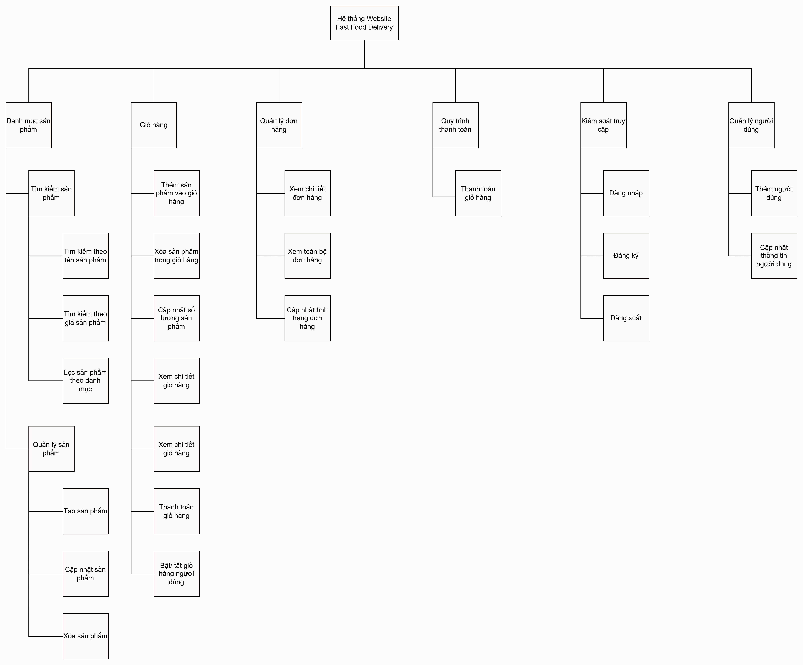
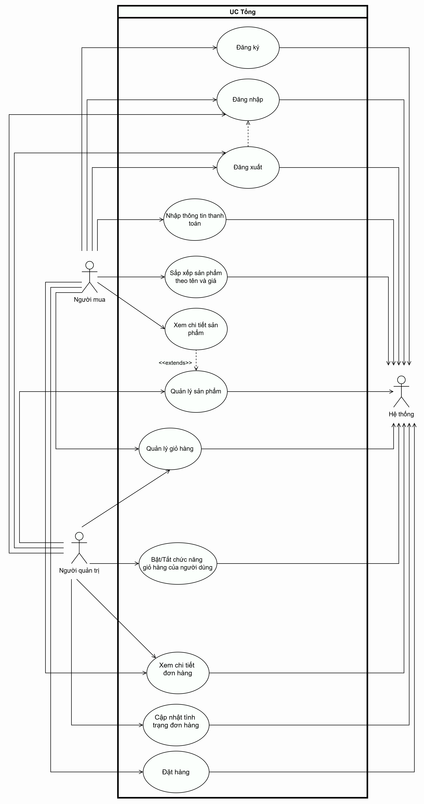
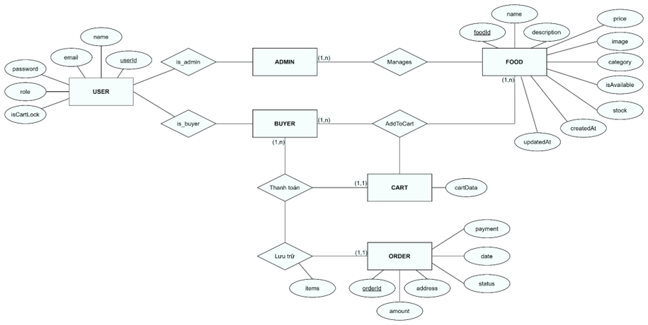
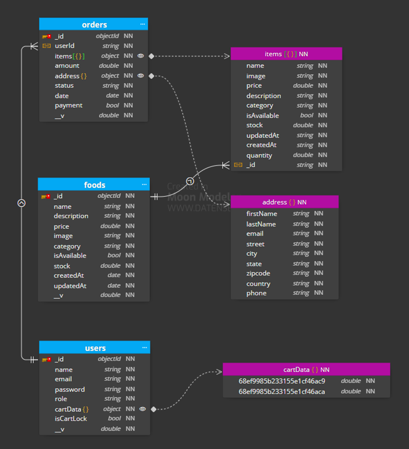
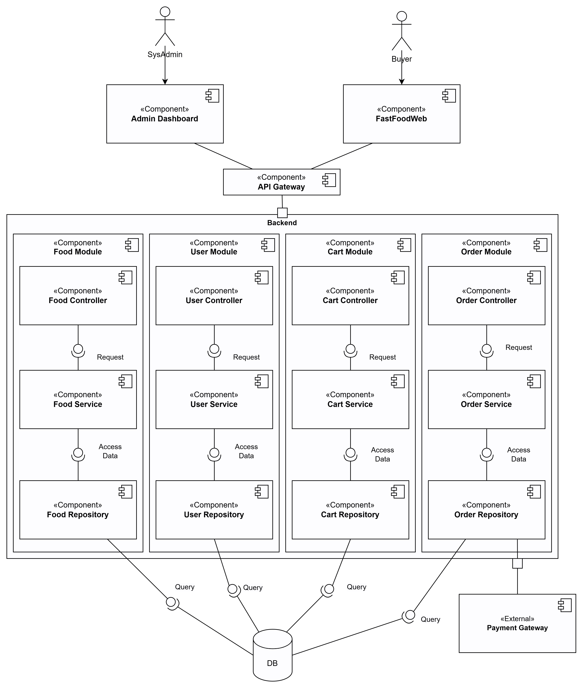
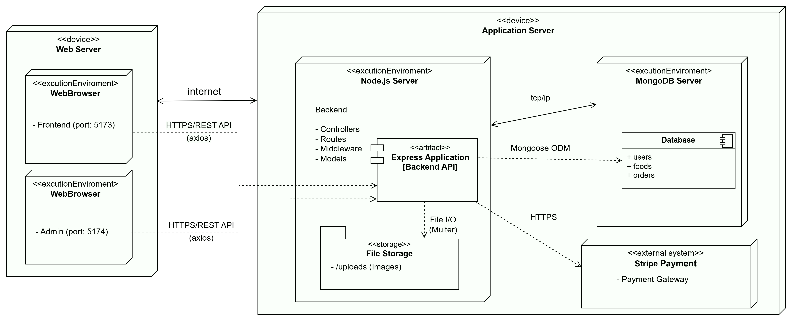

# Yêu cầu hệ thống

## Người mua:
-	Danh mục sản phẩm
    - Sắp xếp sản phẩm theo tên và giá
    - Xem chi tiết sản phẩm
-	Giỏ hàng
    - Quản lý giỏ hàng
      - Thêm sản phẩm vào giỏ hàng
      - Xóa sản phẩm trong giỏ hàng
      - Thanh toán giỏ hàng
      - Cập nhật số lượng sản phẩm trong giỏ hàng
      - Xem chi tiết giỏ hàng
-   Quản lý đơn hàng
    - Đặt hàng
    - Xem chi tiết đơn hàng
-   Quy trình thanh toán
-   Kiểm soát truy cập
    - Đăng ký
    - Đăng nhập
    - Đăng xuất
## Người quản trị: 
-	Danh mục sản phẩm
    - Quản lý sản phẩm
      - Tạo sản phẩm
      - Cập nhật sản phẩm
      - Xóa sản phẩm
-	Giỏ hàng
    - Bật/Tắt chức năng giỏ hàng của người dùng
-   Quản lý đơn hàng
    - Xem chi tiết đơn hàng
    - Cập nhật tình trạng đơn hàng
-   Kiểm soát truy cập
    - Đăng nhập
    - Đăng xuất
-	Quản lý nguời dùng
    - Thêm người dùng
    - Cập nhật thông tin người dùng

# BFD Bảng phân rã chức năng

# Sơ đồ Usecase tổng quan của hệ thống website tiệm bánh

| # | Actor | Định nghĩa |
| ---- | ---- | ---- |
| 1 | Nguời mua | Là người truy cập và tìm kiếm các mặt hàng phù hợp với nhu cầu |
| 2 | Nguời quản trị | Là người quản trị, quản lý website tiệm bánh, có vai trò giám sát hệ thống |

# Database
## Mức quan niệm

## Mức vật lý

# Component Diagram

# Deployment View
