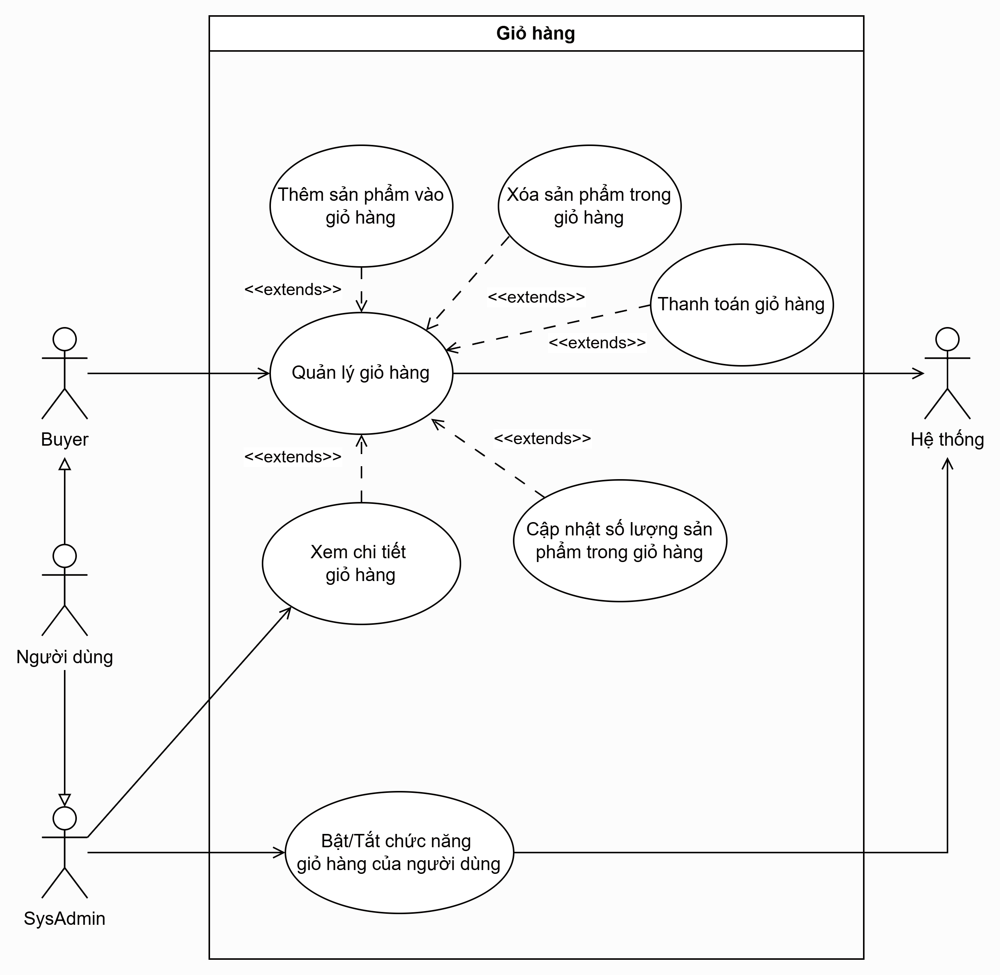
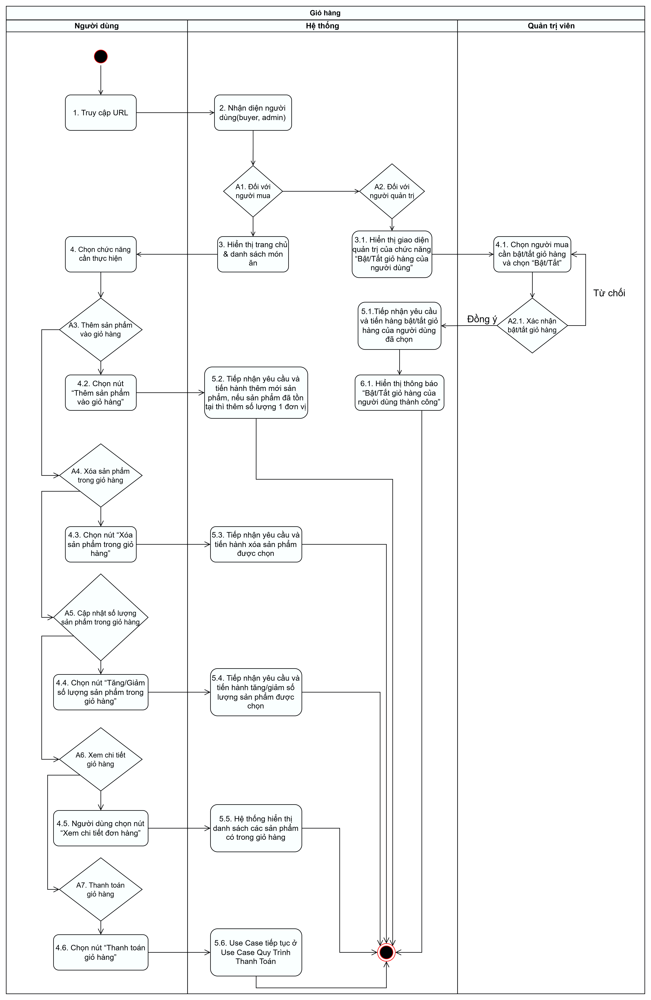

# Yêu cầu hệ thống

## Người mua:
-	Giỏ hàng
    - Quản lý giỏ hàng
      - Thêm sản phẩm vào giỏ hàng
      - Xóa sản phẩm trong giỏ hàng
      - Thanh toán giỏ hàng
      - Cập nhật số lượng sản phẩm trong giỏ hàng
      - Xem chi tiết giỏ hàng
## Người quản trị: 
-	Giỏ hàng
    - Bật/Tắt chức năng giỏ hàng của người dùng

# Sơ đồ Usecase 

# Acitivty

# Sequence
